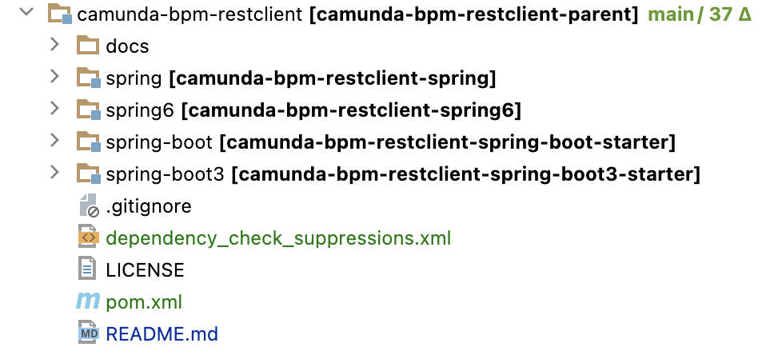

# Camunda BPM REST Client
A community extension for Camunda Platform 7 to use [Camunda REST API](https://docs.camunda.org/manual/latest/reference/rest/openapi) in Java.
Java-Client is generated from [OpenAPI-Definition](/openapi.json).

```xml
<plugin>
  <groupId>org.openapitools</groupId>
  <artifactId>openapi-generator-maven-plugin</artifactId>
  <version>${openapi-generator.version}</version>
  <executions>
    <execution>
      <goals>
        <goal>generate</goal>
      </goals>
      <configuration>
        <inputSpec>/openapi.json</inputSpec>
        <generatorName>java</generatorName>
        <generateApiTests>false</generateApiTests>
        <generateModelTests>false</generateModelTests>
        <configOptions>
          <library>resttemplate</library>
          <basePackage>org.camunda.bpm.rest.client</basePackage>
          <apiPackage>org.camunda.bpm.rest.client.api</apiPackage>
          <modelPackage>org.camunda.bpm.rest.client.model</modelPackage>
          <java8>${openapi-generator.java8}</java8>
          <useSpringBoot3>${openapi-generator.useSpringBoot3}</useSpringBoot3>
          <useJakartaEe>${openapi-generator.useJakartaEe}</useJakartaEe>
          <dateLibrary>legacy</dateLibrary>
          <openApiNullable>false</openApiNullable>
          <!-- Set containers (array, set, map) default to null (default false), see
          https://github.com/OpenAPITools/openapi-generator/blob/master/docs/generators/java.md#config-options
          https://github.com/OpenAPITools/openapi-generator/pull/14130 -->
          <containerDefaultToNull>true</containerDefaultToNull>
        </configOptions>
        <globalProperties>
          <skipFormModel>false</skipFormModel>
        </globalProperties>
      </configuration>
    </execution>
  </executions>
  <dependencies>
    <dependency>
      <groupId>org.camunda.bpm</groupId>
      <artifactId>camunda-engine-rest-openapi</artifactId>
      <version>${camunda.version}</version>
    </dependency>
  </dependencies>
</plugin>
```

We support <mark>2 Versions</mark>:

* Version for <mark>Spring Boot 2</mark> (last Version 2.7.18, see [here](https://spring.io/blog/2023/11/23/spring-boot-2-7-18-available-now#end-of-open-source-support-for-spring-boot-2x)) and <mark>JDK8+</mark>
    * camunda-bpm-restclient-spring (Spring 5.x)
    * camunda-bpm-restclient-spring-boot-starter
* Version for <mark>Spring Boot 3</mark> (actual 3.3.4) and <mark>JDK17+</mark>
    * camunda-bpm-restclient-spring6 (Spring 6.x)
    * camunda-bpm-restclient-spring-boot3-starter



***
<mark>With Spring Boot Starter:</mark>
```xml
<dependency>
  <groupId>camunda-bpm-examples</groupId>
  <artifactId>camunda-bpm-restclient-spring-boot3-starter</artifactId>
  <version>0.0.1-SNAPSHOT</version>
</dependency>
```
Starter-Activation: <ins>application.properties</ins>
```properties
# Camunda REST API
camunda.rest.url=http://localhost:8080/engine-rest
camunda.rest.user=admin
camunda.rest.password=admin
```
Service:
```java
import java.util.Map;

import org.camunda.bpm.rest.client.model.CompleteTaskDto;
import org.camunda.bpm.rest.client.model.VariableValueDto;
import org.camunda.bpm.rest.client.util.WorkflowHelper;
import org.springframework.beans.factory.annotation.Autowired;
import org.springframework.stereotype.Service;

import com.google.common.collect.Maps;

import lombok.extern.slf4j.Slf4j;

@Slf4j
@Service
public class CamundaService {

  @Autowired
  private WorkflowHelper workflowHelper;

  public void completeTask(String taskId, Map<String, Object> variables) {

    log.info("Completing task '{}': {}", taskId, variables);

    Map<String, VariableValueDto> taskVariables = Maps.newHashMap();
    variables.forEach((key, value) -> taskVariables.put(key, new VariableValueDto().value(value)));

    var taskDto = new CompleteTaskDto()
            .variables(taskVariables);

    workflowHelper.getTaskApi().complete(taskId, taskDto);

  }

}
```

***
<mark>Without Spring Boot Starter</mark>:
```xml
<dependency>
  <groupId>camunda-bpm-examples</groupId>
  <artifactId>camunda-bpm-restclient-spring6</artifactId>
  <version>0.0.1-SNAPSHOT</version>
</dependency>
```
Spring Config:
```java
import org.springframework.beans.factory.annotation.Qualifier;
import org.springframework.context.annotation.Bean;
import org.springframework.context.annotation.Configuration;
import org.springframework.web.client.RestTemplate;
 
import org.camunda.bpm.rest.client.ApiClient;
import org.camunda.bpm.rest.client.api.TaskApi;
 
@Configuration
public class CamundaConfig {
 
  private static final String BASE_PATH = "http://localhost:8080/engine-rest";
  public static final String BASIC_AUTH_USERNAME = "admin";
  public static final String BASIC_AUTH_PASSWORD = "admin";
 
  @Bean
  public ApiClient apiClient(@Qualifier("camundaRestTemplate") RestTemplate restTemplate) {
    var apiClient = new ApiClient(restTemplate).setBasePath(BASE_PATH);
    apiClient.setUsername(BASIC_AUTH_USERNAME);
    apiClient.setPassword(BASIC_AUTH_PASSWORD);
    return apiClient;
  }
 
  @Bean
  public TaskApi taskApi(ApiClient apiClient) {
    return new TaskApi(apiClient);
  }
 
}
```

### OWASP dependency check:
```
mvn dependency-check:aggregate -Pdependency-check
```

## License
[Apache License, Version 2.0](./LICENSE)
